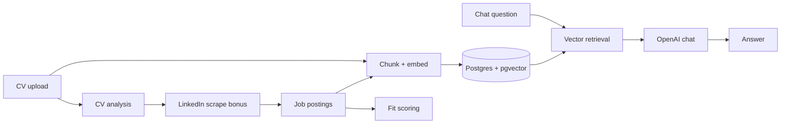

# Career Intelligence (Option 4)

Conversational assistant that compares a **resume** to **job postings** — fit scores, skill gaps, experience alignment, and interview prep.

**Stack:** Next.js · FastAPI · PostgreSQL + pgvector · OpenAI

## Quick start

```bash
cp .env.example .env   # set OPENAI_API_KEY
docker compose up --build
```

| Service | URL |
|---------|-----|
| App | http://localhost:3000 |
| API / Swagger | http://localhost:8000/docs |
| Health | http://localhost:8000/api/v1/health |

Reset DB: `docker compose down -v && docker compose up -d`

Run tests: `make test`

## How it works

### User flow (Option 4 core)

1. **Upload CV** → new chat session, resume parsed and indexed.
2. **Import job postings** → roles available for fit scoring (see bonus below).
3. **Rank & chat** → jobs scored against the CV; pick a role and ask questions in context.

### Bonus: LinkedIn scrape

Not required by the brief — added as a **stretch feature** to auto-import real open roles instead of manual JD upload.

- CV is analyzed first (LLM picks keywords + region), then LinkedIn guest search runs.
- Triggered from chat (“Scrape from LinkedIn”) or the roles panel (“Scrape more”); each run re-analyzes the CV.
- Async runner with start/stop + progress polling; imported jobs are chunked, embedded, and fit-scored.
- More moving parts (HTML parsing, rate limits, authwall risk) — kept separate from the core RAG path.

### RAG chat

- Resume and each job description are split (~900 chars, overlap 150), embedded with `text-embedding-3-small`, stored in **pgvector**.
- On each message: embed query → retrieve top resume + job chunks (selected job, or all jobs for “compare all” queries) → `gpt-4o-mini` with strict context-only system prompt.
- Session history stored in Postgres; suggested prompts and welcome copy are generated from CV + ranked jobs.



## Architecture

```
frontend/     Next.js UI — onboarding, chat, roles panel
backend/      FastAPI — documents, sessions, jobs, chat, LinkedIn sync
infra/        Postgres init (pgvector extension)
migrations/   SQL schema patches on startup
tests/        pytest — chunking, match scoring, CV analysis, health
```

## RAG / LLM choices

| Area | Choice | Why |
|------|--------|-----|
| LLM | `gpt-4o-mini` | Fast, cheap, good enough for structured career Q&A |
| Embeddings | `text-embedding-3-small` | Native OpenAI, 1536-dim, works with pgvector |
| Vector store | pgvector in Postgres | One DB for metadata + vectors; no extra service |
| Orchestration | Custom (no LlamaIndex/LangChain) | Small domain, full control over retrieval + prompts |
| Retrieval | Cosine similarity on chunks; job context by `job_id` | Simple, debuggable |
| Fit score | Mean embedding of resume vs job chunks | Lightweight ranking for the roles panel |
| Guardrails | Context-only prompt; missing-info callouts | Reduces hallucination; not a full eval pipeline |

## Tests & observability

**Tests** (`make test` → 11 unit/API tests):

- Chunking, cosine fit scoring, CV analysis heuristics, compare-all query detection
- Health endpoint (DB + LLM config flags)

**Observability** (lightweight, production-oriented baseline):

- Request logging middleware — method, path, status, duration, `X-Request-ID`
- Chat event logs — session, job, grounded flag, source count
- Extended `/api/v1/health` — `database`, `llm_configured`, degraded status on DB failure

Still out of scope: CI pipeline, OpenTelemetry traces, LLM token metrics dashboard.

## Assignment fit (Option 4)

| Requirement | Status |
|-------------|--------|
| Upload resume | ✅ PDF/DOCX/TXT |
| Multiple job postings | ✅ LinkedIn import (bonus); `POST /jobs` API |
| Questions on fit, gaps, alignment, interview prep | ✅ RAG chat with role context |
| Example queries | ✅ + dynamic suggested prompts |
| Conversational UI | ✅ Session-based chat |
| RAG / retrieval | ✅ pgvector chunk retrieval |
| Working fullstack app | ✅ Docker Compose |
| Tests | ✅ pytest suite |
| Observability | ✅ request + chat logs, health checks |

**Bonus beyond brief:** CV-driven LinkedIn scrape, ranked matches panel, welcome chips, Swagger.

**Known gaps:** LinkedIn guest API may block; no auth; no JD file upload in UI; no streaming chat.

## Productionization (sketch)

- **Deploy:** ECS/Cloud Run + RDS pgvector + S3 uploads + secrets manager
- **Scale:** job queue for LinkedIn sync, read replicas, embedding cache
- **Reliability:** licensed job data API instead of guest scrape
- **Observability:** OpenTelemetry, structured JSON logs, RAG eval sampling

## Engineering notes

- Dockerized dev, typed Python + TypeScript, thin API over services
- **AI-assisted dev:** Cursor for scaffolding; manual review of architecture and prompts

## With more time

- CI + coverage gates, integration tests with test Postgres
- Job description file upload in UI
- Streaming chat, RAG eval set

## Demo


https://github.com/user-attachments/assets/00b4312c-006f-4f00-b69c-760e86ad3904


